# Nemo Voice Typing for macOS — Implementation Plan

A performance-focused, native macOS menu bar app for offline voice typing. Inspired by [Garnet-Owl/nemo-voice-typing](https://github.com/Garnet-Owl/nemo-voice-typing) (Windows), but designed from the ground up for Apple Silicon using CoreML and the Accelerate framework.

**Decisions locked in:**
- **Language:** Swift
- **Inference:** CoreML (`.mlpackage`) — leverage Neural Engine + GPU scheduling
- **Distribution:** Signed + notarized `.dmg` installer
- **Philosophy:** Use the Windows app as *inspiration*, not a 1:1 port. Prioritize performance, low latency, and native macOS idioms.

---

## Architecture Overview

```mermaid
graph LR
    subgraph "Audio Pipeline"
        MIC["🎤 Microphone"] --> AE["AVAudioEngine<br/>Native sample rate"]
        AE --> CONV["AVAudioConverter<br/>→ 16kHz mono Float32"]
    end

    subgraph "DSP (Accelerate.framework)"
        CONV --> MEL["MelExtractor<br/>vDSP FFT + BLAS sgemm"]
    end

    subgraph "Neural Inference (CoreML)"
        MEL --> ENC["Encoder.mlpackage<br/>ANE/GPU scheduled"]
        ENC --> DEC["Decoder.mlpackage<br/>CPU/ANE"]
        DEC --> JNT["Joint.mlpackage<br/>CPU"]
        JNT -->|"greedy argmax"| TOK["Tokenizer"]
    end

    subgraph "Text Output"
        TOK --> PROC["DictationProcessor<br/>Commands + punctuation"]
        PROC --> INJ["TextInjector<br/>CGEvent keystrokes"]
        INJ --> APP["📝 Focused App"]
    end
```



---

## Performance Budget

Target: **≤400ms** end-to-end from speech to text appearing on screen.

| Stage | Budget | Strategy |
|---|---|---|
| **Audio capture** | ~20ms | AVAudioEngine tap, 20ms buffer (320 samples @ 16kHz) |
| **Mel spectrogram** | ≤5ms/chunk | `vDSP.FFT` + `cblas_sgemm` — zero allocations in hot path |
| **Encoder** | ≤150ms/chunk | CoreML `.mlpackage` with Float16 — let macOS schedule ANE/GPU |
| **Decoder loop** | ≤50ms/step | Lightweight LSTM, max 10 symbols per encoder step |
| **Joint network** | ≤5ms/step | Small FC layer, CPU is fine |
| **Text injection** | ≤2ms | CGEvent post is near-instant |
| **Total idle CPU** | ≤8% | `allow_spinning=false`, half-core threading |
| **Memory (model loaded)** | ≤300MB | Float16 models, shared memory with ANE |

---

## Proposed Changes

### Component 1: Model Conversion Pipeline

> [!IMPORTANT]
> CoreML conversion happens **once** at build/release time, not at runtime. We ship pre-converted `.mlpackage` files inside the app bundle *and* host them on HuggingFace for first-run download.

#### [NEW] tools/convert_to_coreml.py

Python script that converts the 3 ONNX models to CoreML `.mlpackage`:

```python
# Converts encoder.onnx, decoder.onnx, joint.onnx → .mlpackage
# Uses coremltools with Float16 precision for ANE optimization
# Handles state tensors as explicit inputs/outputs for streaming
```

- Convert each of the 3 models separately (encoder, decoder, joint)
- Use `compute_precision=ct.precision.FLOAT16` for Apple Silicon optimization
- Use `convert_to="mlprogram"` for `.mlpackage` format
- Verify input/output shapes match the original ONNX model constants
- If any ONNX ops are unsupported by CoreML, fall back to ONNX Runtime for that model only (hybrid strategy)

#### [NEW] tools/verify_coreml.py

- Loads both ONNX and CoreML models
- Runs identical test inputs through both
- Asserts output tensors match within Float16 tolerance
- Reports inference time comparison

> [!WARNING]
> **Fallback strategy:** If CoreML conversion fails for any of the 3 models (e.g., unsupported ONNX ops), that specific model falls back to ONNX Runtime C API while the others stay on CoreML. The app ships with both `.mlpackage` and `.onnx` files.

---

### Component 2: Project Structure

#### [NEW] nemo-voice-typing-macos/

```
nemo-voice-typing-macos/
├── NemoVoiceTyping.xcodeproj
├── Package.swift                        # SPM: HotKey
├── tools/
│   ├── convert_to_coreml.py             # ONNX → CoreML conversion
│   ├── verify_coreml.py                 # Accuracy verification
│   └── create_dmg.sh                    # Build + sign + notarize + DMG
├── NemoVoiceTyping/
│   ├── App/
│   │   ├── NemoVoiceTypingApp.swift      # @main, SwiftUI App lifecycle
│   │   ├── AppDelegate.swift             # NSApplicationDelegate, wires everything
│   │   └── AppConfig.swift               # Codable config, persisted to disk
│   ├── UI/
│   │   ├── MenuBarController.swift       # NSStatusItem + context menu
│   │   ├── FloatingPanelWindow.swift     # NSPanel (non-activating, always-on-top)
│   │   └── FloatingPanelView.swift       # SwiftUI: mic button, level bars, loading
│   ├── Audio/
│   │   ├── AudioCapture.swift            # AVAudioEngine → 16kHz float PCM
│   │   └── MelExtractor.swift            # Accelerate vDSP FFT + BLAS mel filterbank
│   ├── ASR/
│   │   ├── ASREngine.swift               # Protocol: pushAudio → token callback
│   │   ├── CoreMLASREngine.swift          # CoreML inference (primary)
│   │   ├── OnnxASREngine.swift            # ONNX Runtime fallback (if CoreML fails)
│   │   ├── Tokenizer.swift               # vocab.txt loader
│   │   └── GreedyDecoder.swift           # RNN-T greedy search loop
│   ├── TextOutput/
│   │   ├── TextInjector.swift            # CGEvent keystroke injection
│   │   └── DictationProcessor.swift      # Word assembly, commands, punctuation
│   ├── Services/
│   │   ├── HotkeyManager.swift           # HotKey library wrapper
│   │   ├── ModelManager.swift            # Download + cache + load models
│   │   ├── StartupManager.swift          # SMAppService login item
│   │   └── PermissionManager.swift       # Accessibility + Microphone permission checks
│   ├── Pipeline/
│   │   └── DictationController.swift     # Orchestrates the full pipeline
│   ├── Resources/
│   │   ├── Assets.xcassets/              # App icon, menu bar template icon
│   │   └── Info.plist                    # LSUIElement, usage descriptions
│   └── NemoVoiceTyping.entitlements      # Hardened runtime, no sandbox
└── Tests/
    ├── MelExtractorTests.swift
    ├── TokenizerTests.swift
    ├── DictationProcessorTests.swift
    └── TextInjectorTests.swift
```

Key design difference from Windows version: **ASREngine is a protocol**, allowing hot-swapping between CoreML and ONNX Runtime backends.

---

### Component 3: Audio Pipeline (Performance-Critical)

#### [NEW] AudioCapture.swift

```swift
// Low-latency audio capture using AVAudioEngine
// - Taps inputNode at hardware native rate
// - Converts to 16kHz mono Float32 via AVAudioConverter (created once, reused)
// - 20ms buffer size (320 samples) for snappy first-word latency
// - RMS level calculation using vDSP.meanSquare (vectorized, zero-alloc)
// - Callback: onSamples([Float]), onLevel(Double)
```

Performance considerations:
- `AVAudioConverter` created once in `start()`, reused for every tap callback
- Output buffer pre-allocated and reused (no allocations in hot path)
- RMS computed via `vDSP_measqv` (single SIMD instruction)
- Tap callback is on a real-time audio thread — no locks, no allocations, no ObjC

#### [NEW] MelExtractor.swift

```swift
// Hardware-accelerated log-mel spectrogram using Accelerate.framework
// Parameters match the NeMo model: n_fft=512, hop=160, win=400, 128 mels
//
// Performance strategy:
// - vDSP.FFT setup created once, reused across all frames
// - Hann window pre-computed as [Float], applied via vDSP_vmul
// - Power spectrum via vDSP_zvmags (complex multiply)
// - Mel projection via cblas_sgemm (BLAS matrix multiply)
// - Log via vForce.log (vectorized log on entire mel array)
// - Pre-emphasis via vDSP_vsmsma (fused multiply-add)
// - ALL buffers pre-allocated — zero heap allocations in compute()
```

Expected: **≤3ms per 560ms chunk** on M1 (vs ~15ms with naive Swift loops).

---

### Component 4: CoreML Inference Engine

#### [NEW] ASREngine.swift (Protocol)

```swift
protocol ASREngine {
    func loadModel(from directory: URL) async throws
    func pushAudio(_ samples: [Float])
    func reset()
    var onTokenEmitted: ((String) -> Void)? { get set }
}
```

#### [NEW] CoreMLASREngine.swift

```swift
// CoreML-based streaming RNN-T inference
// - Loads Encoder.mlpackage, Decoder.mlpackage, Joint.mlpackage
// - Uses MLModel with MLPredictionOptions for ANE/GPU scheduling
// - Encoder: chunked transformer, 560ms audio → 7 encoder frames
// - Decoder: stateful LSTM, states passed as explicit I/O tensors
// - Joint: FC layer, argmax for greedy decoding
//
// Performance strategy:
// - MLMultiArray with .float16 data type where supported
// - Pre-allocated MLMultiArray buffers (no per-frame allocation)
// - Encoder runs on ANE/GPU (large transformer)
// - Decoder/Joint run on CPU (small, sequential, not worth ANE overhead)
// - State arrays: use MLMultiArray.dataPointer for zero-copy updates
```

#### [NEW] GreedyDecoder.swift

```swift
// RNN-T greedy search loop, separated from inference backend
// - Drives the encoder→decoder→joint→argmax loop
// - Max 10 symbols per encoder time step
// - Blank token detection (id=1024)
// - State management (h, c tensors for LSTM)
// - Calls tokenEmitted callback with decoded piece
```

#### [NEW] OnnxASREngine.swift (Fallback)

```swift
// ONNX Runtime C API fallback — only used if CoreML conversion
// fails for any of the 3 sub-models
// - Thin Swift wrapper via bridging header
// - Same interface as CoreMLASREngine
// - Uses CPU execution provider with half-core threading
```

---

### Component 5: Text Output Pipeline

#### [NEW] TextInjector.swift

```swift
// Injects text into the focused app via CGEvent
//
// type(_ text: String):
//   - For each character: CGEvent with keyboardSetUnicodeString
//   - Post via .cghidEventTap (requires Accessibility permission)
//   - Handles full Unicode (BMP + supplementary via surrogate pairs)
//
// backspace(count:):
//   - Posts CGKeyCode(51) down+up pairs
//
// pressEnter():
//   - Posts CGKeyCode(36) down+up pair
//
// Performance: CGEvent posting is ~0.1ms per character
```

#### [NEW] DictationProcessor.swift

Inspired by the Windows version's `DictationProcessor.cs` but not a line-for-line port:

- Word buffering with sub-word piece assembly
- Voice commands: "period", "comma", "question mark", "exclamation mark", "colon", "semicolon"
- Layout commands: "new line", "new paragraph"  
- Undo commands: "scratch that", "delete that", "delete last"
- Auto-capitalisation at sentence start
- 1200ms buffer idle flush, 1500ms command window
- Uses `CFAbsoluteTimeGetCurrent()` for timing (nanosecond precision)

---

### Component 6: UI

#### [NEW] MenuBarController.swift

- `NSStatusItem` with template microphone icon (respects light/dark mode)
- Left-click: toggle floating panel visibility
- Right-click context menu:
  - Toggle Dictation (`⌘⌥A`)
  - Show/Hide Panel
  - ─── separator ───
  - Start at Login (checkbox)
  - ─── separator ───
  - Quit Nemo Voice Typing

#### [NEW] FloatingPanelWindow.swift

- `NSPanel` subclass with style: `.nonactivatingPanel`, `.hudWindow`
- Level: `.floating` (always on top, doesn't steal focus from target app)
- Draggable via `mouseDown`/`mouseDragged`
- Position persisted to `AppConfig`
- Hosts `FloatingPanelView` via `NSHostingView`

#### [NEW] FloatingPanelView.swift

SwiftUI view — compact pill design:

- Microphone toggle button (idle: grey, active: green pulse)
- 5 audio level bars with smooth decay animation
- Loading state: pulsing bars + progress text
- Dark vibrancy material background (`.regularMaterial`)
- Minimal size: ~120×44pt

---

### Component 7: Services

#### [NEW] ModelManager.swift

- Model cache: `~/Library/Application Support/NemoVoiceTyping/models/v3/`
- Downloads from HuggingFace (`Garnet-Owl/nemo-voice-typing-asr`)
- Downloads both CoreML `.mlpackage` files AND `.onnx` files (for fallback)
- Progress reporting via async stream
- Atomic downloads: `.part` → rename on completion
- File list validation before marking complete

#### [NEW] HotkeyManager.swift

- Uses [HotKey](https://github.com/soffes/HotKey) SPM package
- Default: `⌘+⌥+A` (Command+Option+A)
- Configurable via `AppConfig.hotkey`
- Carbon `RegisterEventHotKey` under the hood — no Accessibility permission needed

#### [NEW] StartupManager.swift

- `SMAppService.mainApp` (macOS 13+) for login item registration
- Toggle via menu bar checkbox
- Persisted in `AppConfig.runAtStartup`

#### [NEW] PermissionManager.swift

```swift
// Handles first-run permission prompts:
// 1. Microphone: AVCaptureDevice.requestAccess(for: .audio)
// 2. Accessibility: AXIsProcessTrusted() check
//    - If not trusted, open System Settings deep link
//    - Poll until granted (with user-friendly instructions)
```

#### [NEW] AppConfig.swift

```swift
struct AppConfig: Codable {
    var modelDirectory: String = ""     // override, empty = use default cache
    var hotkey: String = "⌘⌥A"         // configurable shortcut
    var runAtStartup: Bool = false
    var panelX: Double = .nan           // persisted panel position
    var panelY: Double = .nan
    var alwaysOnTop: Bool = true
    var preferCoreML: Bool = true       // false = force ONNX fallback
}
// Stored at: ~/Library/Application Support/NemoVoiceTyping/config.json
```

---

### Component 8: Distribution

#### [NEW] tools/create_dmg.sh

```bash
#!/bin/bash
# 1. xcodebuild archive → .xcarchive
# 2. xcodebuild -exportArchive → .app
# 3. codesign --deep --force --options runtime --sign "Developer ID"
# 4. hdiutil create -volname "Nemo Voice Typing" -srcfolder .app → .dmg
# 5. codesign the .dmg
# 6. xcrun notarytool submit → wait → staple
# Output: NemoVoiceTyping-1.0.dmg (ready for distribution)
```

DMG layout:
- App icon on the left
- Arrow pointing to Applications alias on the right
- Background image with "Drag to install" instruction

---

## Development Phases

### Phase 1: Skeleton + UI Shell
- Xcode project with SPM (HotKey)
- `MenuBarController` + `FloatingPanelWindow` + `FloatingPanelView`
- `AppConfig` load/save
- `HotkeyManager` registration
- **✅ Milestone:** App appears in menu bar, hotkey toggles floating pill

### Phase 2: Audio Capture + Visualization
- `AudioCapture` with AVAudioEngine
- `MelExtractor` with Accelerate.framework
- Wire audio levels to floating panel bars
- **✅ Milestone:** Hotkey starts mic, bars animate with voice, verify 16kHz PCM output

### Phase 3: Model Conversion + Inference
- `convert_to_coreml.py` script
- `verify_coreml.py` accuracy check
- `CoreMLASREngine` + `GreedyDecoder`
- `Tokenizer`
- (If needed) `OnnxASREngine` fallback
- **✅ Milestone:** Spoken words produce token callbacks, verify against Windows version output

### Phase 4: Text Pipeline
- `TextInjector` with CGEvent
- `DictationProcessor` (commands, punctuation, capitalization)
- `DictationController` orchestration
- `PermissionManager` for Accessibility
- **✅ Milestone:** Full pipeline — speak → text appears in TextEdit

### Phase 5: Model Download + Polish + Ship
- `ModelManager` with HuggingFace download + progress UI
- `StartupManager` for login item
- First-run experience (permission prompts, model download progress)
- App icon design
- `create_dmg.sh` build + sign + notarize pipeline
- **✅ Milestone:** Distributable `.dmg` that works end-to-end

---

## Verification Plan

### Performance Benchmarks
```
Instrument with Xcode Instruments (Time Profiler + Neural Engine):
- [ ] MelExtractor: ≤5ms per 560ms chunk
- [ ] CoreML Encoder: ≤150ms per chunk
- [ ] Decoder+Joint loop: ≤50ms per encoder step
- [ ] End-to-end latency: ≤400ms speech-to-text
- [ ] Idle CPU when not dictating: ≤1%
- [ ] Active dictation CPU: ≤15% on M1
- [ ] Memory with model loaded: ≤300MB
```

### Unit Tests
- `MelExtractorTests`: Compare output against Python `librosa` reference (within Float16 tolerance)
- `TokenizerTests`: Load vocab, verify piece lookup, boundary detection
- `DictationProcessorTests`: Voice commands, punctuation attachment, auto-capitalization, undo

### Integration Tests
- Audio format verification: confirm 16kHz mono Float32 from `AudioCapture`
- CoreML vs ONNX output comparison: identical tokens for same audio input

### Manual Testing Matrix
| Test | Apps to verify |
|---|---|
| Text injection | TextEdit, Terminal, Safari, VS Code, Slack, Notes |
| Hotkey registration | With/without other apps using global shortcuts |
| Floating panel | Drag, position persistence, always-on-top across Spaces |
| Voice commands | "period", "comma", "new line", "scratch that", "delete last" |
| Model download | Fresh install, interrupted download resume, offline after download |
| Permissions | Fresh install Accessibility prompt, Microphone prompt |
| Hardware | Apple Silicon (M1/M2/M3/M4), Intel Mac (if ONNX fallback) |
| Login item | Toggle on, reboot, verify auto-launch |
